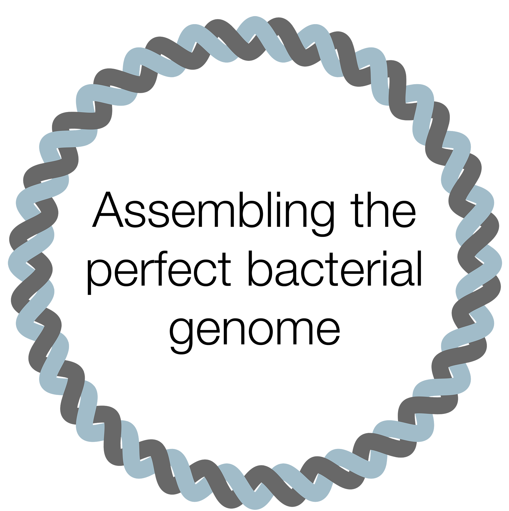

<picture><source srcset="images/logo-dark.png" media="(prefers-color-scheme: dark)"></picture>

This repo contains a tutorial for assembling a bacterial genome to perfection using short and long reads.

Head over to [this repo's wiki](https://github.com/rrwick/Perfect-bacterial-genome-tutorial/wiki) for the tutorial and all supporting content.
